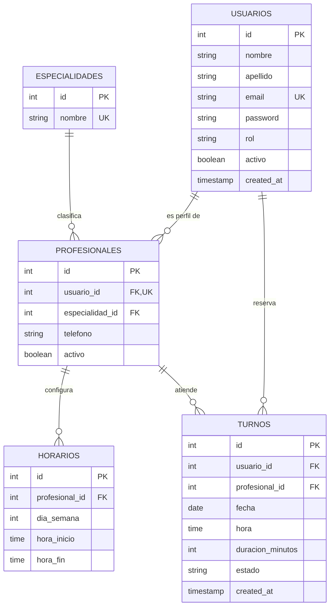

# 🗓️ TurnoFácil - Sistema de Gestión de Turnos

> **Trabajo Final Integrador (TFI)**
> 🎓 **Carrera:** Tecnicatura Universitaria en Programación (TUP) — UTN
> 👥 **Equipo:** Gabriel Carbajal, Cristian Paolucci, Lautaro Pez
> 👩‍🏫 **Tutora:** Sofía Raia

---

## 📋 Índice

1. [👥 Integrantes y Enfoque de Trabajo](#-integrantes-y-enfoque-de-trabajo)
2. [🎯 Descripción y Visión de Negocio](#-descripción-y-visión-de-negocio)
3. [⚠️ Problemática y Justificación](#️-problemática-y-justificación)
4. [🎯 Objetivos](#-objetivos)
5. [👤 Actores del Sistema](#-actores-del-sistema)
6. [📦 Alcance y Módulos del MVP](#-alcance-y-módulos-del-mvp)
7. [📝 Historias de Usuario](#-historias-de-usuario)
8. [⚠️ Riesgos, Supuestos y Restricciones](#️-riesgos-supuestos-y-restricciones)
9. [🗄️ Modelo de Base de Datos](#️-modelo-de-base-de-datos)
10. [🏗️ Arquitectura y Stack Tecnológico](#️-arquitectura-y-stack-tecnológico)
11. [🔌 Contratos de API REST](#-contratos-de-api-rest)
12. [🚀 Roadmap de Escalabilidad](#-roadmap-de-escalabilidad)

---

## 👥 Integrantes y Enfoque de Trabajo

El equipo de desarrollo está conformado por:

* **Gabriel Carbajal**
* **Cristian Paolucci**
* **Lautaro Pez**

**Tutora:** Sofía Raia

Para la ejecución del proyecto se adopta un enfoque de ingeniería basado en **buenas prácticas de la industria** y **metodologías ágiles**.

Las responsabilidades técnicas y funcionales se gestionan de manera transversal, promoviendo la colaboración integral en todas las capas del software:

* 💻 Frontend
* ⚙️ Backend
* 🗄️ Base de Datos
* 🔀 Control de versiones con Git
* 🌿 Estrategias de ramificación
* 👀 Revisiones de código mediante Pull Requests

---

## 🎯 Descripción y Visión de Negocio

**TurnoFácil** es una solución web centralizada diseñada para **optimizar, agilizar y automatizar la gestión de agendas de profesionales independientes**.

Está orientada a profesionales como:

* 🩺 Médicos
* 🧠 Psicólogos
* 🥗 Nutricionistas
* 🦵 Kinesiólogos
* 📚 Profesores particulares
* 👨‍⚕️ Otros profesionales independientes

El sistema busca superar la simple digitalización de una agenda, proporcionando un entorno **robusto, seguro y escalable** que permita equilibrar:

> **La eficiencia operativa del profesional + una experiencia de usuario simple y fluida para el cliente.**

---

## ⚠️ Problemática y Justificación

### 📌 Situación Actual

Actualmente, muchos profesionales independientes gestionan sus turnos mediante herramientas informales como:

* 📱 WhatsApp
* 📒 Agendas físicas
* 💬 Mensajería instantánea
* 📑 Registros manuales

Esta modalidad genera diferentes problemas administrativos y operativos.

### 🔴 Principales problemas detectados

| Problema                          | Descripción                                                                                    |
| --------------------------------- | ---------------------------------------------------------------------------------------------- |
| ⏰ **Superposición de horarios**   | Errores humanos en el control manual de disponibilidad que pueden generar conflictos de citas. |
| 📥 **Falta de trazabilidad**      | Pérdida de solicitudes y mensajes importantes dentro de bandejas de entrada saturadas.         |
| 🔄 **Fricción operativa**         | Procesos lentos y manuales para reprogramar o cancelar turnos.                                 |
| 🗂️ **Inexistencia de historial** | Falta de un registro centralizado y seguro de las interacciones con los clientes.              |

### 💡 Solución propuesta

Implementar una plataforma digital que permita:

* Centralizar la gestión de turnos.
* Automatizar la disponibilidad.
* Reducir errores humanos.
* Evitar superposición de horarios.
* Facilitar cancelaciones y reprogramaciones.
* Mantener un historial organizado.
* Liberar tiempo administrativo del profesional.

---

## 🎯 Objetivos

### 🏆 Objetivo General

Desarrollar, desplegar y documentar un **Producto Mínimo Viable (MVP)** funcional de software web durante el ciclo del TFI.

El sistema contará con una arquitectura **desacoplada y robusta**, orientada a resolver la problemática de gestión de turnos de profesionales independientes.

### 📌 Objetivos Específicos

#### 🔐 Seguridad y Autenticación

Implementar un sistema de autenticación basado en:

* Roles de usuario.
* Tokens seguros.
* Spring Security.
* Protección de rutas del backend.

#### 🗄️ Consistencia de Datos

Diseñar y normalizar una base de datos relacional utilizando **PostgreSQL**, garantizando:

* Integridad referencial.
* Consistencia de datos.
* Validaciones transaccionales.
* Prevención de cruces de agendas.

#### 🎨 Experiencia de Usuario

Construir una interfaz web:

* Interactiva.
* Responsiva.
* Adaptada a dispositivos móviles.
* Adaptada a dispositivos de escritorio.

Tecnologías principales:

**React + Vite + Tailwind CSS**

---

## 👤 Actores del Sistema

### 👨‍💻 Cliente / Paciente

Es el usuario final de la plataforma.

Puede:

* Registrarse.
* Iniciar sesión.
* Buscar profesionales por especialidad.
* Consultar disponibilidad.
* Solicitar turnos.
* Reprogramar turnos.
* Cancelar turnos.
* Consultar su historial.

### 🩺 Profesional / Administrador

Es el prestador del servicio.

Puede:

* Gestionar su perfil.
* Configurar sus días de atención.
* Definir franjas horarias.
* Visualizar su agenda.
* Administrar el estado de los turnos.
* Consultar información mediante un Dashboard.

---

## 📦 Alcance y Módulos del MVP

### 👤 Módulo de Usuarios

* Registro de nuevos usuarios.
* Inicio de sesión seguro.
* Recuperación de contraseña *(opcional)*.
* Gestión de roles.

### 🩺 Módulo de Profesionales

* Alta de profesionales.
* Baja de profesionales.
* Modificación de perfiles.
* Configuración de días disponibles.
* Configuración de horarios de atención.

### 📅 Módulo de Turnos

* Solicitud de turnos.
* Consulta de disponibilidad.
* Reprogramación de citas.
* Cancelación de turnos.
* Gestión del estado del turno.

### 📊 Módulo Administrativo

* Dashboard general.
* Visualización de turnos.
* Gestión general de usuarios.
* Estadísticas básicas de utilización de la agenda.

---

## 🚧 Exclusiones del MVP

Para evitar el crecimiento descontrolado del alcance (*Scope Creep*), las siguientes funcionalidades quedan fuera de la primera versión:

* 💳 Integración con Mercado Pago o Stripe.
* 🧾 Facturación electrónica automatizada.
* 🏛️ Sincronización con organismos fiscales como AFIP.
* 📱 Envío masivo de SMS.
* 💬 Integración con APIs de WhatsApp de pago.

> Estas funcionalidades quedan contempladas para **futuras etapas de escalabilidad**.

---

## ⚙️ Requerimientos No Funcionales

### 🔐 Seguridad

* Contraseñas protegidas mediante algoritmos de hashing seguros.
* Utilización de **BCrypt**.
* Protección de rutas de la API REST.

### ⚡ Rendimiento

El sistema apunta a obtener:

> **Tiempos de respuesta inferiores a 2 segundos** en consultas estándar de disponibilidad de agenda.

### 🧹 Mantenibilidad

El código debe aplicar:

* Diseño modular.
* Separación de responsabilidades.
* Clean Code.
* Arquitectura por capas.
* Buenas prácticas de desarrollo en Java/Spring Boot.

---

## 📝 Historias de Usuario

### HU01 — Registro de Nuevos Usuarios

> **Como** cliente,
> **quiero** registrarme en la plataforma con mi correo electrónico y contraseña,
> **para** acceder a las funcionalidades del sistema.

#### ✅ Criterio de Aceptación — Given / When / Then

**Given:** el usuario se encuentra en el formulario de registro.

**When:** ingresa credenciales válidas y que no existen previamente en el sistema.

**Then:** la base de datos almacena la información de forma segura y permite posteriormente iniciar sesión.

---

### HU02 — Solicitud de Turno

> **Como** cliente autenticado,
> **quiero** seleccionar un profesional y un espacio horario disponible,
> **para** reservar una cita de manera autónoma.

#### ✅ Criterio de Aceptación — Given / When / Then

**Given:** el usuario visualiza la agenda libre de un profesional en una fecha determinada.

**When:** selecciona un horario disponible y confirma la operación.

**Then:** el sistema genera un registro de turno en estado **Pendiente/Confirmado** y bloquea inmediatamente el horario para evitar solapamientos.

---

### HU03 — Configuración de Disponibilidad Horaria

> **Como** profesional autenticado,
> **quiero** configurar mis días y franjas horarias de atención,
> **para** que los clientes puedan solicitar citas únicamente dentro de mi disponibilidad real.

#### ✅ Criterio de Aceptación — Given / When / Then

**Given:** el profesional accede a su panel de gestión de agenda.

**When:** define los días de la semana y los rangos horarios de atención.

**Then:** el sistema actualiza la base de datos y habilita esos bloques horarios para los clientes.

---

### HU04 — Visualización del Dashboard

> **Como** administrador o profesional,
> **quiero** visualizar un panel de control con el estado general de los turnos,
> **para** realizar un seguimiento operativo de la jornada.

#### ✅ Criterio de Aceptación — Given / When / Then

**Given:** el profesional inicia sesión con rol administrativo.

**When:** accede a la sección de Dashboard.

**Then:** el sistema muestra de forma estructurada los turnos:

* 🟡 Pendientes
* 🟢 Confirmados
* 🔴 Cancelados

correspondientes al día actual.

---

## ⚠️ Riesgos, Supuestos y Restricciones

### 💭 Supuestos

Se considera que:

* El equipo mantendrá una dedicación horaria constante.
* Existirán canales de comunicación fluidos durante el desarrollo.
* Las plataformas cloud seleccionadas mantendrán estabilidad operativa durante las pruebas y la entrega final.

Plataformas consideradas:

**Render · Vercel · Supabase**

### 🚨 Riesgos y Mitigación

| Riesgo                                           | Mitigación                                                                                    |
| ------------------------------------------------ | --------------------------------------------------------------------------------------------- |
| 🔄 **Desfasaje entre Backend y Frontend**        | Definición temprana de los contratos de API y utilización de Pull Requests.                   |
| ☁️ **Curva de aprendizaje del despliegue cloud** | Realización de despliegues incrementales y pruebas de conectividad desde las primeras etapas. |

### ⛔ Restricciones

**Temporal**

Plazos académicos establecidos por el cronograma de la cátedra universitaria.

**Tecnológica**

Uso obligatorio de:

* Control de versiones.
* Arquitectura por capas.
* Patrones arquitectónicos.
* Java/Spring Boot.

---

## 🗄️ Modelo de Base de Datos

El sistema utiliza un **modelo relacional normalizado** para garantizar la integridad y consistencia de la información.

### 📊 Tablas principales

#### 👤 Usuarios

| Campo      | Descripción                           |
| ---------- | ------------------------------------- |
| `id`       | Clave primaria                        |
| `nombre`   | Nombre del usuario                    |
| `apellido` | Apellido del usuario                  |
| `email`    | Correo electrónico                    |
| `password` | Contraseña almacenada de forma segura |
| `rol`      | Rol dentro del sistema                |

#### 🩺 Profesionales

| Campo          | Descripción              |
| -------------- | ------------------------ |
| `id`           | Clave primaria           |
| `usuario_id`   | FK → usuarios            |
| `especialidad` | Especialidad profesional |
| `telefono`     | Teléfono de contacto     |

#### 🕐 Horarios

| Campo            | Descripción        |
| ---------------- | ------------------ |
| `id`             | Clave primaria     |
| `profesional_id` | FK → profesionales |
| `dia_semana`     | Día de la semana   |
| `hora_inicio`    | Inicio de atención |
| `hora_fin`       | Fin de atención    |

#### 📅 Turnos

| Campo            | Descripción                                     |
| ---------------- | ----------------------------------------------- |
| `id`             | Clave primaria                                  |
| `usuario_id`     | FK → usuarios                                   |
| `profesional_id` | FK → profesionales                              |
| `fecha`          | Fecha del turno                                 |
| `hora`           | Hora del turno                                  |
| `estado`         | Pendiente / Confirmado / Cancelado / Finalizado |

### 🔗 Modelo Entidad-Relación



---

## 🏗️ Arquitectura y Stack Tecnológico

El proyecto adopta una **arquitectura desacoplada de tres capas lógicas**:

```text
┌─────────────────────────────┐
│       🎨 PRESENTACIÓN       │
│   React + Vite + Tailwind   │
└──────────────┬──────────────┘
               │
               ▼
┌─────────────────────────────┐
│     ⚙️ LÓGICA DE NEGOCIO    │
│ Java + Spring Boot + JPA    │
│      + Spring Security      │
└──────────────┬──────────────┘
               │
               ▼
┌─────────────────────────────┐
│       🗄️ PERSISTENCIA       │
│          PostgreSQL         │
└─────────────────────────────┘
```

### 💻 Frontend

* **React**
* **Vite**
* **Tailwind CSS**
* **JavaScript / TypeScript**

☁️ **Hosting:** Vercel

### ⚙️ Backend

* **Java**
* **Spring Boot**
* **Spring Data JPA**
* **Hibernate**
* **Spring Security**

☁️ **Hosting:** Render

### 🗄️ Base de Datos

* **PostgreSQL**

☁️ **Hosting:** Supabase

### 🔀 Control de Versiones

* **Git**
* **GitHub**
* Flujo basado en ramas.
* Code Review.
* Pull Requests.
* Control de entregas.

---

## 🔌 Contratos de API REST

### 🔐 Autenticación y Usuarios

```http
POST /api/auth/register
```

Registro de nuevos usuarios.

```http
POST /api/auth/login
```

Autenticación y generación del token seguro **JWT**.

---

### 🩺 Profesionales y Agendas

```http
GET /api/professionals
```

Obtiene el listado general de profesionales disponibles.

```http
GET /api/professionals/{id}/availability
```

Consulta los horarios disponibles de un profesional en una fecha determinada.

```http
POST /api/professionals/availability
```

Permite configurar las franjas horarias disponibles del profesional.

---

### 📅 Gestión de Turnos

```http
POST /api/appointments
```

Solicita y bloquea un nuevo turno.

```http
GET /api/appointments/user/{id}
```

Obtiene el historial de turnos de un cliente.

```http
PUT /api/appointments/{id}/cancel
```

Realiza la cancelación lógica de un turno.

---

## 🚀 Roadmap de Escalabilidad

La evolución del sistema se plantea mediante diferentes etapas.

### 🟢 Fase 1 — MVP

**Versión inicial funcional**

Incluye:

* 🔐 Autenticación con Spring Security.
* 👤 Gestión de perfiles.
* 🩺 Gestión de profesionales.
* 🕐 Configuración de agendas.
* 📅 Selección de turnos.
* 📊 Panel de control.
* 🗄️ PostgreSQL.

---

### 🔵 Fase 2 — Notificaciones Automatizadas

Incorporación de:

* 📧 Alertas por correo electrónico.
* 📱 APIs oficiales de mensajería.
* ⏰ Recordatorios automáticos.
* 🔔 Avisos de turnos próximos.

Ejemplo:

> Recordatorio automático **24 horas antes** del turno.

---

### 🟣 Fase 3 — Monetización

Incorporación de:

* 💳 Pasarelas de pago.
* 💰 Pago de señas.
* 🧾 Abonado previo de consultas.
* 🔒 Procesamiento seguro de pagos.

---

### 🟠 Fase 4 — Analítica Avanzada

Implementación de:

* 📊 Reportes estadísticos.
* 📈 Métricas de rendimiento.
* 📅 Análisis de utilización de agendas.
* 👥 Estadísticas sobre clientes.
* 📋 Indicadores para profesionales.

---

### 📋 Reglas de Negocio del Sistema

El sistema implementa de forma lógica y transaccional las siguientes reglas de negocio para garantizar la consistencia operativa y respaldar las validaciones del backend:

* **RN-01: Disponibilidad horaria obligatoria**  
  Un cliente no puede reservar un turno fuera de la franja horaria y los días de la semana configurados previamente por el profesional en su agenda.
* **RN-02: Prevención de superposición de agendas**  
  Un profesional no puede tener dos turnos activos (pendientes o confirmados) superpuestos en el mismo segmento de fecha y hora. Esta regla se refuerza mediante el índice único condicional en la base de datos que excluye únicamente a los turnos cancelados.
* **RN-03: Liberación automática de horarios**  
  Un turno que adquiere el estado `CANCELADO` libera de forma automática el bloque horario correspondiente, permitiendo que el espacio vuelva a estar disponible para nuevas reservas de cualquier cliente.
* **RN-04: Restricciones de cancelación y reprogramación**  
  Los turnos solo pueden ser cancelados o reprogramados mientras se encuentren en estado `PENDIENTE` o `CONFIRMADO`, manteniendo el registro histórico en el sistema mediante la baja lógica para conservar la trazabilidad.
* **RN-05: Restricción de acceso por roles**  
  Un usuario con rol `CLIENTE` no puede modificar ni configurar agendas profesionales, así como tampoco acceder a los paneles de control administrativos del sistema.

  ---

## 🎓 Trabajo Final Integrador

**TurnoFácil** integra conocimientos de diferentes áreas de la **Tecnicatura Universitaria en Programación de la UTN**, combinando:

> **Gestión de Desarrollo de Software + Metodología de Sistemas + Programación + Bases de Datos**

El objetivo es desarrollar una solución tecnológica que combine **arquitectura, programación, persistencia de datos y gestión de proyectos** dentro de un producto de software funcional y escalable.
