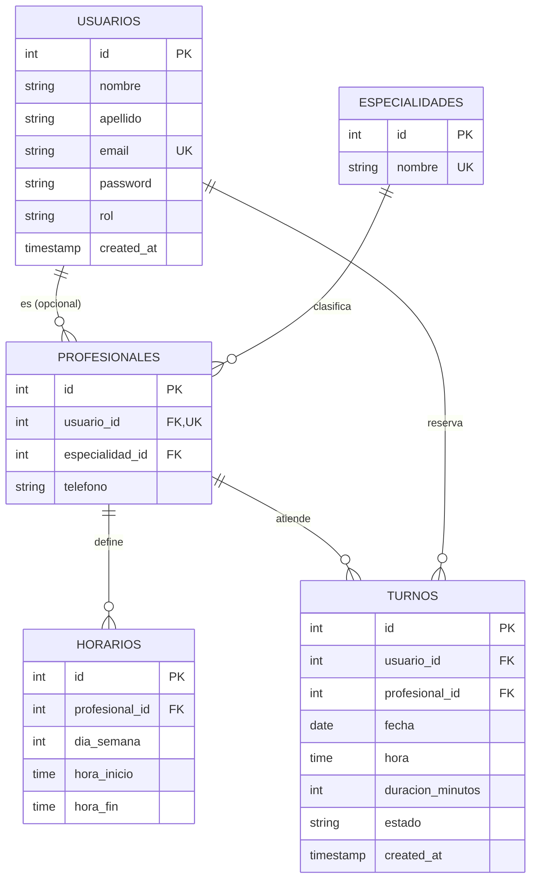

🏥 **TurnoFácil — Especificación de Arquitectura, Esquema de Base de Datos y Desglose Modular**

---

> **Trabajo Final Integrador (TFI)** — **Carrera:** Tecnicatura Universitaria en Programación (TUP) — **UTN**  
> 👥 **Equipo:** Gabriel Carbajal, Cristian Paolucci, Lautaro Pez | 👩‍🏫 **Tutora:** Sofia Raia

---

📋 **Índice**

---

* 1. 📄 Introducción y Propósito del Documento
* 2. 🏗️ Arquitectura del Sistema y Patrones de Diseño
* 3. 🗄️ Modelo Lógico y Relacional de Base de Datos (PostgreSQL)
* 4. 📦 Desglose Modular y Estructura del Repositorio
* 5. 🔀 Estrategia de Control de Versiones y Flujo de Trabajo (Git Workflow)
* 6. 🏁 Conclusión y Próximos Pasos

---

### 1. 📄 Introducción y Propósito del Documento

---

El presente documento formaliza la **Segunda Instancia de Avance (Diseño y Módulos)** del proyecto **TurnoFácil**, conforme los lineamientos metodológicos de la currícula. Su propósito central es establecer los cimientos arquitectónicos, el modelo relacional de persistencia y la descomposición modular que regirán el ciclo de desarrollo de software en el repositorio único de GitHub. Este diseño garantiza la consistencia transaccional, el desacoplamiento de capas y la escalabilidad del Producto Mínimo Viable (MVP) antes de la fase de implementación intensiva.

---

### 2. 🏗️ Arquitectura del Sistema y Patrones de Diseño

---

El sistema adopta una arquitectura desacoplada de tres capas lógicas, separando de manera estricta la interfaz de usuario, la lógica de negocio y la persistencia de datos mediante contratos claros de comunicación:

* 💻 **Capa de Presentación (Frontend):**
  * **Tecnologías:** React 18+, Vite, Tailwind CSS.
  * **Hosting:** Vercel.
  * **Responsabilidad:** Renderizado de la interfaz, experiencia de usuario (UX/UI) y consumo de la API REST mediante clientes HTTP.

* ⚙️ **Capa de Lógica de Negocio y API (Backend):**
  * **Tecnologías:** Java 17+, Spring Boot, Spring Security (JWT).
  * **Hosting:** Render.
  * **Responsabilidad:** Procesamiento de reglas de negocio, validaciones transaccionales y seguridad en los endpoints.

* 🗄️ **Capa de Persistencia (Base de Datos):**
  * **Tecnologías:** PostgreSQL Relacional, Spring Data JPA / Hibernate.
  * **Hosting:** Supabase.
  * **Responsabilidad:** Almacenamiento seguro, normalización y garantía de integridad referencial.

#### 2.1 Principios de Diseño Aplicados
* **Separación de Responsabilidades (SoC):** Cada capa posee una única razón de cambio.
* **Diseño Orientado a Servicios (RESTful):** La comunicación cliente-servidor se efectúa mediante contratos HTTP estrictos, utilizando códigos de estado estándar, transferencia de datos estructurados en formato JSON y autenticación basada en claims con JSON Web Tokens (JWT).

---

3. 🗄️ Modelo Lógico y Relacional de Base de Datos (PostgreSQL)

Para asegurar la integridad referencial, evitar anomalías de actualización y prevenir cruces o superposiciones críticas en las agendas, se diseña un esquema relacional normalizado en PostgreSQL.

### 3.1 Diagrama Entidad-Relación (ER)

A continuación, se visualiza el diagrama entidad-relación del sistema, detallando las entidades, sus atributos principales, tipos de datos, claves primarias (PK), claves foráneas (FK) y las cardinalidades de cada relación:



3.2 Justificación del Nivel de Normalización
El diseño de la base de datos se encuentra estructurado bajo la Tercera Forma Normal (3FN).

Forma Normal alcanzada: El esquema cumple con la 1FN (atributos atómicos), la 2FN (atributos dependientes por completo de la clave primaria) y la 3FN (ausencia de dependencias transitivas, donde los atributos que no son clave dependen exclusivamente de la clave primaria).

Anomalías evitadas: Un ejemplo clave de esto es la separación de la tabla especialidades. Si en lugar de ello se hubiera modelado la especialidad como un simple campo de texto (VARCHAR) dentro de la tabla profesionales, se habrían generado anomalías de actualización y redundancia de datos. Por ejemplo, si fuera necesario corregir el nombre de una especialidad (como cambiar "Cardiología" por "Cardiología Clínica"), habría que actualizar múltiples filas de profesionales de manera manual, corriendo el riesgo de inconsistencias. Al aislarla en su propia tabla relacionada por clave foránea (especialidad_id), la modificación se realiza en un único registro, garantizando la integridad referencial y la consistencia de los datos.

### 3.3 DDL Preliminar (Definición de Esquema)

```sql
-- 1. Tabla de Usuarios (Centraliza la autenticación y control de accesos)
CREATE TABLE usuarios (
    id SERIAL PRIMARY KEY,
    nombre VARCHAR(100) NOT NULL,
    apellido VARCHAR(100) NOT NULL,
    email VARCHAR(150) UNIQUE NOT NULL,
    password VARCHAR(255) NOT NULL, -- Hash BCrypt
    rol VARCHAR(30) NOT NULL CHECK (rol IN ('CLIENTE', 'PROFESIONAL', 'ADMINISTRADOR')),
    activo BOOLEAN NOT NULL DEFAULT TRUE,
    created_at TIMESTAMP DEFAULT CURRENT_TIMESTAMP
);

-- 2. Tabla de Especialidades (Normalización)
CREATE TABLE especialidades (
    id SERIAL PRIMARY KEY,
    nombre VARCHAR(100) NOT NULL UNIQUE
);

-- 3. Tabla de Profesionales
CREATE TABLE profesionales (
    id SERIAL PRIMARY KEY,
    usuario_id INT NOT NULL UNIQUE,
    especialidad_id INT NOT NULL,
    telefono VARCHAR(30) NOT NULL,
    activo BOOLEAN NOT NULL DEFAULT TRUE,
    CONSTRAINT fk_profesional_usuario FOREIGN KEY (usuario_id) REFERENCES usuarios(id),
    CONSTRAINT fk_profesional_especialidad FOREIGN KEY (especialidad_id) REFERENCES especialidades(id)
);

-- 4. Tabla de Horarios (Disponibilidad semanal configurada por el profesional)
CREATE TABLE horarios (
    id SERIAL PRIMARY KEY,
    profesional_id INT NOT NULL,
    dia_semana INT NOT NULL CHECK (dia_semana BETWEEN 1 AND 7), -- 1: Lunes, 7: Domingo
    hora_inicio TIME NOT NULL,
    hora_fin TIME NOT NULL,
    CONSTRAINT fk_horario_profesional FOREIGN KEY (profesional_id) REFERENCES profesionales(id) ON DELETE CASCADE
);

-- 5. Tabla de Turnos (Núcleo transaccional - Incluye duración según corrección de la tutora)
CREATE TABLE turnos (
    id SERIAL PRIMARY KEY,
    usuario_id INT NOT NULL, -- Cliente
    profesional_id INT NOT NULL, -- Profesional
    fecha DATE NOT NULL,
    hora TIME NOT NULL,
    duracion_minutos INT NOT NULL DEFAULT 30, -- Resuelve solapamientos parciales
    estado VARCHAR(30) NOT NULL DEFAULT 'PENDIENTE' CHECK (estado IN ('PENDIENTE', 'CONFIRMADO', 'CANCELADO', 'FINALIZADO')),
    created_at TIMESTAMP DEFAULT CURRENT_TIMESTAMP,
    CONSTRAINT fk_turno_cliente FOREIGN KEY (usuario_id) REFERENCES usuarios(id),
    CONSTRAINT fk_turno_profesional FOREIGN KEY (profesional_id) REFERENCES profesionales(id)
);

-- Índice único condicional: evita solapamientos solo para turnos NO cancelados
CREATE UNIQUE INDEX uk_agenda_profesional_activos 
ON turnos (profesional_id, fecha, hora) 
WHERE estado != 'CANCELADO';
```

### 3.4 Políticas de Borrado y Trazabilidad (Baja Lógica / Soft Delete)
Para dar cumplimiento al requisito de trazabilidad y mantenimiento de un historial organizado de turnos, se prescinde del borrado físico en cascada (ON DELETE CASCADE) sobre entidades críticas del sistema (usuarios y profesionales).

Mecanismo implementado: Se adopta una política de baja lógica (Soft Delete) mediante la incorporación de un campo de control de estado (activo BOOLEAN DEFAULT TRUE) en las tablas correspondientes.

Beneficio funcional: Cuando un usuario o un profesional deja de operar en la plataforma, su registro no se elimina de la base de datos de forma física. De esta forma, se preserva la integridad de la tabla turnos y de las relaciones históricas, permitiendo auditar turnos pasados, reportes operativos y estadísticas sin perder trazabilidad.

4. 📦 Desglose Modular y Estructura del Repositorio
El código fuente se estructurará de forma modular dentro del repositorio único de GitHub, facilitando la división de tareas en el equipo y la claridad en las revisiones de código (Pull Requests).

4.1 Módulos Funcionales del MVP
🔐 Módulo de Autenticación y Control de Accesos (Security & Users):

Gestión de altas de usuarios con encriptación de credenciales (BCrypt).

Emisión y validación de tokens JWT mediante Spring Security para proteger los recursos de la API.

Gestión de roles y permisos diferenciados (Cliente vs. Profesional/Admin).

🩺 Módulo de Gestión Profesional y Agendas (Professionals & Availability):

Operaciones CRUD sobre perfiles profesionales y especialidades.

Configuración y persistencia de franjas horarias semanales de atención.

Endpoints de consulta de disponibilidad en tiempo real para el cliente.

📅 Módulo de Gestión Transaccional de Turnos (Appointments):

Solicitud de turnos bajo validación de solapamiento (apoyado por el índice único compuesto en base de datos).

Consulta de historial de turnos por cliente o profesional.

Cancelación lógica de citas con actualización de estados.

📊 Módulo de Panel de Control Operativo (Dashboard & UI):

Interfaz centralizada en React para visualización de la agenda diaria.

Filtros dinámicos por estado de turno (Pendiente, Confirmado, Cancelado).

4.2 Organización de Directorios en el Repositorio de GitHub

```text
├── backend/                  # Servidor API REST (Java / Spring Boot)
│   ├── src/main/java/com/turnofacil/
│   │   ├── controller/       # Controladores REST (Endpoints)
│   │   ├── service/          # Lógica de Negocio y Servicios
│   │   ├── repository/       # Interfaces Spring Data JPA
│   │   ├── model/            # Entidades y Mapeo ORM (JPA Entities)
│   │   └── security/         # Configuración de Spring Security y JWT
│   └── pom.xml
├── frontend/                 # Interfaz de Usuario (React / Vite / Tailwind)
│   ├── src/
│   │   ├── components/       # Componentes reutilizables UI
│   │   ├── pages/            # Vistas principales (Dashboard, Login, Agenda)
│   │   └── services/         # Clientes Axios para consumo de API REST
│   │       └── App.jsx
│   └── package.json
├── database/                 # Scripts SQL de inicialización y DDL
│   └── schema.sql
├── README.md                 # Documentación técnica general del proyecto
└── .gitignore
```

5. 🔀 Estrategia de Control de Versiones y Flujo de Trabajo (Git Workflow)
Para asegurar la calidad del código y mantener la estabilidad de la rama principal (main o develop), el equipo implementará el siguiente protocolo de desarrollo:

🌿 Ramas por Funcionalidad (Feature Branches): Ningún cambio directo sobre la rama principal. Cada módulo o tarea se desarrollará en una rama derivada (ej. feature/modulo-turnos, fix/seguridad-jwt).

👀 Revisiones Cruzadas (Pull Requests): Todo incremento de código requerirá al menos la aprobación de un miembro distinto del equipo antes de ser integrado (Code Review cruzado).

🧪 Validación de Integridad: Se realizarán pruebas locales de integración entre el backend de Spring Boot y el frontend de React previo a la consolidación de entregables.

5. 📋 Reglas de Negocio Explícitas

Para garantizar la integridad operativa, la consistencia de los datos y proveer las validaciones lógicas necesarias para la programación del backend, se formalizan las siguientes reglas de negocio del sistema:

* **RN-01: Disponibilidad horaria obligatoria**  
  Un cliente no puede reservar un turno fuera de la franja horaria y los días de la semana configurados previamente por el profesional en su agenda.
* **RN-02: Prevención de superposición de agendas**  
  Un profesional no puede tener dos turnos activos (pendientes o confirmados) superpuestos en el mismo segmento de fecha y hora. Esta regla se implementa a nivel de persistencia mediante un índice único condicional en la base de datos que excluye únicamente a los turnos cancelados.
* **RN-03: Liberación automática de horarios**  
  Un turno que adquiere el estado `CANCELADO` libera de forma automática el bloque horario correspondiente, permitiendo que el espacio vuelva a estar disponible para nuevas reservas de cualquier cliente.
* **RN-04: Restricciones de cancelación y reprogramación**  
  Los turnos solo pueden ser cancelados o reprogramados mientras se encuentren en estado `PENDIENTE` o `CONFIRMADO`. Se establece un margen de validación lógica previo a la cita, conservando en todo momento el registro mediante baja lógica para no perder trazabilidad en el historial.
* **RN-05: Restricción de acceso por roles**  
  Un usuario con rol `CLIENTE` no posee permisos para modificar ni configurar agendas profesionales, ni para acceder a los paneles de control administrativos del sistema.

6. 🏁 Conclusión y Próximos Pasos
Con la presentación y aprobación de este documento técnico de diseño y la estructuración modular inicial en el repositorio, el equipo de TurnoFácil cumple formalmente con los requisitos de la 2.ª Entrega (Condición de Regular).

Una vez obtenido el aval explícito de la tutora Sofia Raia y del comité, el proyecto procederá a la fase de implementación intensiva del código fuente, despliegue incremental en servicios cloud (Render, Vercel, Supabase) y preparación orientada hacia la entrega final del sistema.
