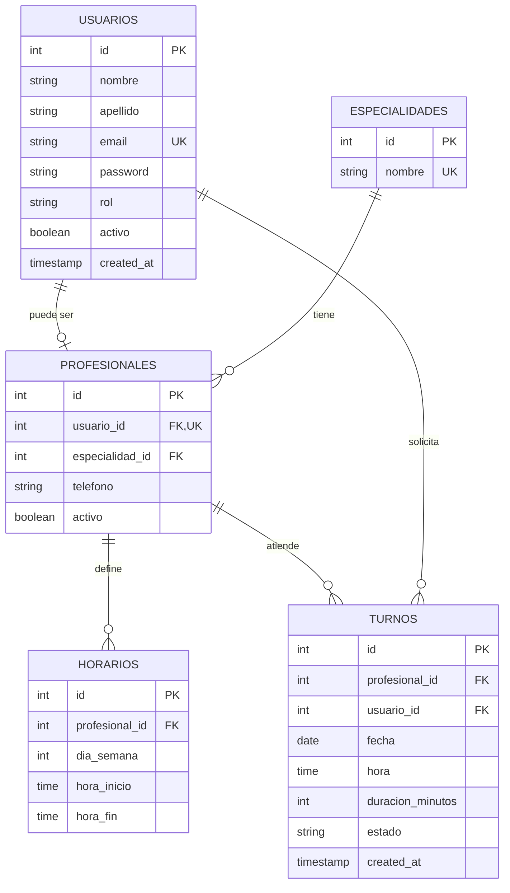

# Segunda Entrega — TurnoFácil

## Índice

1. [Introducción](#1--introducción)
2. [Arquitectura del Sistema](#2--arquitectura-del-sistema)
3. [Modelo Lógico / Relacional](#3--modelo-lógico--relacional)
   - [3.1 Diagrama Entidad-Relación](#31--diagrama-entidad-relación)
   - [3.2 Normalización](#32--normalización)
   - [3.3 ️ DDL de la Base de Datos](#33--ddl-de-la-base-de-datos)
   - [3.4 ️ Políticas de Borrado y Trazabilidad](#34--políticas-de-borrado-y-trazabilidad)
4. [Desglose Modular y Estructura del Repositorio](#4--desglose-modular-y-estructura-del-repositorio)
   - [4.1 Desglose Modular](#41--desglose-modular)
   - [4.2 Estructura del Repositorio](#42--estructura-del-repositorio)
5. [Reglas de Negocio Explícitas](#5--reglas-de-negocio-explícitas)
6. [Estrategia de Control de Versiones y Flujo de Trabajo](#6--estrategia-de-control-de-versiones-y-flujo-de-trabajo)
7. [Conclusión y Próximos Pasos](#7--conclusión-y-próximos-pasos)

---

## 1.  Introducción

TurnoFácil es un sistema orientado a la gestión de turnos para profesionales, permitiendo administrar usuarios, profesionales, especialidades, horarios y turnos.

La segunda entrega tiene como objetivo presentar la arquitectura propuesta, el modelo lógico y relacional de la base de datos, la normalización aplicada, las reglas de negocio, el desglose modular del sistema y la estrategia utilizada para el control de versiones.

Esta documentación busca establecer una base técnica clara para las siguientes etapas del desarrollo.

---

## 2.  Arquitectura del Sistema

El sistema adopta una arquitectura de tres capas, separando las responsabilidades principales de la aplicación.

### Capa de Presentación

Es la responsable de la interacción con el usuario y de la interfaz de la aplicación.

En esta capa se encuentran los componentes correspondientes al frontend.

### Capa de Lógica de Negocio

Contiene las reglas y operaciones propias del sistema, como:

- Gestión de usuarios.
- Gestión de profesionales.
- Gestión de especialidades.
- Gestión de horarios.
- Gestión de turnos.
- Validación de disponibilidad.
- Control de cancelaciones y reprogramaciones.

### Capa de Datos

Es responsable del almacenamiento y persistencia de la información.

La base de datos utilizada es PostgreSQL y contiene las tablas necesarias para representar usuarios, profesionales, especialidades, horarios y turnos.

La separación en capas permite mantener una distribución clara de responsabilidades y facilita el mantenimiento y evolución del sistema.

---

# 3.  Modelo Lógico / Relacional

## 3.1 📊 Diagrama Entidad-Relación

El siguiente diagrama representa las principales entidades de la base de datos, sus atributos, claves primarias, claves foráneas y relaciones.


```mermaid
erDiagram
    USUARIOS {
        int id PK
        string nombre
        string apellido
        string email UK
        string password
        string rol
        boolean activo
        timestamp created_at
    }

    ESPECIALIDADES {
        int id PK
        string nombre UK
    }

    PROFESIONALES {
        int id PK
        int usuario_id FK, UK
        int especialidad_id FK
        string telefono
        boolean activo
    }

    HORARIOS {
        int id PK
        int profesional_id FK
        int dia_semana
        time hora_inicio
        time hora_fin
    }

    TURNOS {
        int id PK
        int profesional_id FK
        int usuario_id FK
        date fecha
        time hora
        int duracion_minutos
        string estado
        timestamp created_at
    }

    USUARIOS ||--o| PROFESIONALES : "puede ser"
    ESPECIALIDADES ||--o{ PROFESIONALES : "tiene"
    PROFESIONALES ||--o{ HORARIOS : "define"
    PROFESIONALES ||--o{ TURNOS : "atiende"
    USUARIOS ||--o{ TURNOS : "solicita"
```

**Atributos clave destacados:**
* **USUARIOS**: incluye el campo `activo` para la baja lógica preservando el historial.
* **PROFESIONALES**: incluye el campo `activo` para la baja lógica manteniendo la trazabilidad.


### Relaciones principales

- Un usuario puede estar asociado a un profesional.
- Una especialidad puede estar asociada a varios profesionales.
- Un profesional puede tener varios horarios de atención.
- Un profesional puede atender múltiples turnos.
- Un usuario puede solicitar múltiples turnos.

## 3.2 📐 Normalización

El modelo relacional se encuentra normalizado hasta la Tercera Forma Normal (3FN).

Primera Forma Normal (1FN)

Se cumple porque los atributos de las tablas contienen valores atómicos y no existen grupos repetitivos dentro de una misma columna.

Por ejemplo, un profesional no almacena múltiples especialidades en un único campo de texto.

Segunda Forma Normal (2FN)

Se cumple porque los atributos no clave dependen de la totalidad de la clave primaria correspondiente.

Las entidades poseen identificadores propios y los atributos pertenecientes a cada entidad dependen de su respectiva clave.

Tercera Forma Normal (3FN)

Se cumple porque los atributos no clave no dependen de otros atributos no clave.

Por ejemplo, las especialidades se encuentran separadas en la tabla especialidades y los profesionales utilizan una clave foránea especialidad_id.

Esto evita almacenar repetidamente el nombre de una especialidad dentro de cada registro de profesional.

De esta forma se evita una anomalía de actualización. Si el nombre de una especialidad cambiara, sería necesario modificar un único registro en especialidades en lugar de modificar múltiples registros de profesionales.

Por lo tanto, la separación de entidades permite reducir redundancia y mantener la integridad de los datos.

## 3.3  DDL de la Base de Datos

El siguiente DDL representa la estructura utilizada para la base de datos PostgreSQL.

```SQL
-- 1. Tabla de Usuarios (Centraliza la autenticación y control de accesos)
CREATE TABLE usuarios (
    id SERIAL PRIMARY KEY,
    nombre VARCHAR(100) NOT NULL,
    apellido VARCHAR(100) NOT NULL,
    email VARCHAR(150) UNIQUE NOT NULL,
    password VARCHAR(255) NOT NULL, -- Hash BCrypt
    rol VARCHAR(30) NOT NULL CHECK (rol IN ('CLIENTE', 'PROFESIONAL', 'ADMINISTRADOR')),
    activo BOOLEAN NOT NULL DEFAULT TRUE,
    created_at TIMESTAMP DEFAULT CURRENT_TIMESTAMP
);

-- 2. Tabla de Especialidades (Normalización)
CREATE TABLE especialidades (
    id SERIAL PRIMARY KEY,
    nombre VARCHAR(100) NOT NULL UNIQUE
);

-- 3. Tabla de Profesionales
CREATE TABLE profesionales (
    id SERIAL PRIMARY KEY,
    usuario_id INT NOT NULL UNIQUE,
    especialidad_id INT NOT NULL,
    telefono VARCHAR(30) NOT NULL,
    activo BOOLEAN NOT NULL DEFAULT TRUE,
    CONSTRAINT fk_profesional_usuario FOREIGN KEY (usuario_id) REFERENCES usuarios(id),
    CONSTRAINT fk_profesional_especialidad FOREIGN KEY (especialidad_id) REFERENCES especialidades(id)
);

-- 4. Tabla de Horarios (Disponibilidad semanal configurada por el profesional)
CREATE TABLE horarios (
    id SERIAL PRIMARY KEY,
    profesional_id INT NOT NULL,
    dia_semana INT NOT NULL CHECK (dia_semana BETWEEN 1 AND 7), -- 1: Lunes, 7: Domingo
    hora_inicio TIME NOT NULL,
    hora_fin TIME NOT NULL,
    CONSTRAINT fk_horario_profesional FOREIGN KEY (profesional_id) REFERENCES profesionales(id) ON DELETE CASCADE,
    CONSTRAINT chk_horario_valido CHECK (hora_fin > hora_inicio)
);

-- 5. Tabla de Turnos (Núcleo transaccional con control real de solapamiento parcial por duración)
CREATE EXTENSION IF NOT EXISTS btree_gist;

CREATE TABLE turnos (
    id SERIAL PRIMARY KEY,
    usuario_id INT NOT NULL, -- Cliente
    profesional_id INT NOT NULL, -- Profesional
    fecha DATE NOT NULL,
    hora TIME NOT NULL,
    duracion_minutos INT NOT NULL DEFAULT 30, -- Duración del turno en minutos
    CHECK (duracion_minutos > 0),
    estado VARCHAR(30) NOT NULL DEFAULT 'PENDIENTE' CHECK (
        estado IN (
            'PENDIENTE',
            'CONFIRMADO',
            'CANCELADO',
            'FINALIZADO'
        )
    ),
    created_at TIMESTAMP DEFAULT CURRENT_TIMESTAMP,
    CONSTRAINT fk_turno_cliente FOREIGN KEY (usuario_id) REFERENCES usuarios(id),
    CONSTRAINT fk_turno_profesional FOREIGN KEY (profesional_id) REFERENCES profesionales(id),
    
    -- Restricción de exclusión: Evita solapamientos parciales de turnos activos usando rangos de tiempo (tsrange)
    CONSTRAINT no_solapamiento_turnos EXCLUDE USING gist (
        profesional_id WITH =,
        tsrange(
            (fecha + hora)::timestamp,
            (fecha + hora + (duracion_minutos * interval '1 minute'))::timestamp,
            '[)'
        ) WITH &&
    ) WHERE (estado != 'CANCELADO')
);
```
### Validaciones implementadas

El modelo incluye restricciones para garantizar la consistencia de los datos:

dia_semana solamente admite valores entre 1 y 7.
hora_fin debe ser posterior a hora_inicio.
duracion_minutos debe ser mayor que cero.
estado solamente puede tomar los valores definidos.
El correo electrónico de los usuarios es único.
El usuario asociado a un profesional es único.
La base de datos impide la superposición de turnos activos para un mismo profesional.

La restricción:

CONSTRAINT no_solapamiento_turnos
EXCLUDE USING gist

permite impedir que dos turnos activos de un mismo profesional ocupen intervalos de tiempo superpuestos.

Los turnos cancelados quedan excluidos de esta restricción mediante:

WHERE (estado != 'CANCELADO')

Esto permite que una vez cancelado un turno, ese espacio horario pueda volver a utilizarse.

## 3.4  Políticas de Borrado y Trazabilidad

Para preservar la trazabilidad de los datos históricos, se utiliza el atributo activo en entidades críticas como usuarios y profesionales.

De esta forma, un usuario o profesional puede quedar inactivo sin eliminar físicamente su registro.

Esto permite conservar la información histórica asociada a los turnos realizados o cancelados.

En el caso de los horarios, se utiliza:

ON DELETE CASCADE

sobre la relación entre horarios y profesionales, debido a que los horarios dependen directamente del profesional y no representan información histórica que deba conservarse de forma independiente.

En cambio, los turnos mantienen sus referencias a usuarios y profesionales, evitando eliminar información histórica asociada a ellos.

La estrategia general es priorizar la baja lógica mediante activo para las entidades cuya información debe conservarse para trazabilidad.

# 4. 📦 Desglose Modular y Estructura del Repositorio

## 4.1 🧩 Desglose Modular

El sistema se organiza en módulos funcionales que separan las responsabilidades principales.

Usuarios

Responsable de la gestión de usuarios del sistema, incluyendo sus datos básicos, rol y estado de actividad.

Profesionales

Permite gestionar la información específica de los profesionales, su especialidad, teléfono y estado de actividad.

Especialidades

Permite administrar las especialidades disponibles y asociarlas con los profesionales.

Horarios

Permite definir los días y horarios de atención de cada profesional.

Turnos

Gestiona la creación, confirmación, cancelación y finalización de turnos.

Además, este módulo aplica las reglas relacionadas con la disponibilidad y evita la superposición de turnos mediante la restricción de exclusión:

no_solapamiento_turnos

## 4.2 📁 Estructura del Repositorio
```
TurnoFacil---Trabajo-Final-TUP/
│
├── backend/
│
├── database/
│   └── schema.sql
│
├── docs/
│   └── SEGUNDA_ENTREGA.md
│
├── frontend/
│
├── .gitignore
│
├── HISTORIAL.md
│
└── README.md
```

# 5. 📋 Reglas de Negocio Explícitas
RN-01 — Disponibilidad de profesionales

Los turnos solamente pueden solicitarse dentro de los horarios de atención definidos para el profesional.

La disponibilidad se determina a partir de los registros existentes en la tabla horarios.

RN-02 — Prevención de superposición de agendas

Un profesional no puede tener dos turnos activos que se superpongan en el tiempo.

Se consideran activos los turnos cuyo estado sea:

PENDIENTE
CONFIRMADO
FINALIZADO

Los turnos con estado CANCELADO no bloquean la disponibilidad.

La base de datos implementa esta regla mediante la restricción de exclusión:

CONSTRAINT no_solapamiento_turnos
EXCLUDE USING gist

De esta manera, la regla no depende únicamente de la lógica de la aplicación, sino que también queda garantizada a nivel de base de datos.

RN-03 — Cancelación y liberación del horario

Cuando un turno es cancelado, deja de bloquear el horario correspondiente.

Esto se logra mediante la condición:

WHERE (estado != 'CANCELADO')

de la restricción no_solapamiento_turnos.

Por lo tanto, un horario ocupado por un turno cancelado puede ser utilizado nuevamente.

RN-04 — Cancelación y reprogramación

La cancelación o reprogramación de un turno está permitida únicamente para turnos en estado:

PENDIENTE
CONFIRMADO

Además, estas operaciones deben realizarse con una anticipación mínima de dos horas respecto del turno.

Los turnos finalizados o cancelados no pueden volver a modificarse.

RN-05 — Restricción por roles

Las operaciones disponibles para cada usuario dependen del rol asignado.

El sistema diferencia las acciones correspondientes a los distintos tipos de usuario, evitando que un usuario realice operaciones que no le corresponden.

# 6. 🔀 Estrategia de Control de Versiones y Flujo de Trabajo

El proyecto utiliza Git y GitHub como herramientas para el control de versiones.

El repositorio remoto permite centralizar el código y mantener un historial de los cambios realizados.

El flujo de trabajo utilizado contempla:

Crear o modificar los archivos correspondientes.
Revisar los cambios realizados.
Registrar los cambios mediante un commit.
Subir los cambios al repositorio remoto mediante push.
Verificar que el repositorio de GitHub contenga la versión actualizada.

Los commits permiten identificar las modificaciones realizadas durante el desarrollo y facilitan el seguimiento de las distintas entregas.

El archivo .gitignore permite evitar subir archivos temporales, configuraciones locales u otros elementos que no deben formar parte del repositorio.

# 7. 🏁 Conclusión y Próximos Pasos

La segunda entrega establece la base técnica del proyecto TurnoFácil.

Se definió una arquitectura de tres capas, un modelo relacional normalizado hasta 3FN y un esquema de base de datos PostgreSQL con restricciones destinadas a garantizar la integridad de la información.

También se documentaron las principales reglas de negocio, incluyendo la disponibilidad de profesionales, la prevención de superposición de turnos, la liberación de horarios mediante cancelaciones y las políticas de cancelación y reprogramación.

La utilización de una restricción EXCLUDE USING gist permite garantizar directamente desde la base de datos que no existan turnos activos superpuestos para un mismo profesional.

Como próximos pasos se contempla continuar con la implementación e integración de los distintos módulos del sistema, incorporando las funcionalidades definidas para la aplicación y validando su funcionamiento de manera integral.
